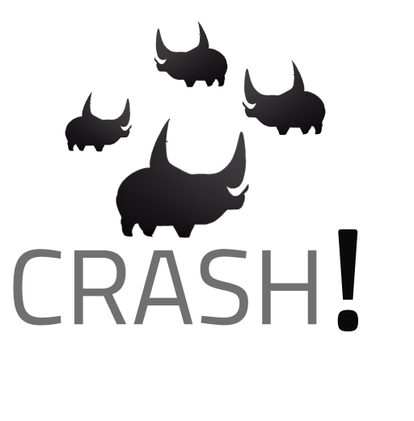

<a name="readme-top"></a>

<!-- PROJECT SHIELDS -->
[![Contributors][contributors-shield]][contributors-url]
[![Forks][forks-shield]][forks-url]
[![Stargazers][stars-shield]][stars-url]
[![Issues][issues-shield]][issues-url]
[![MIT License][license-shield]][license-url]

<!-- PROJECT LOGO -->
<div align="center">
  <a href="https://github.com/clicketyclackety/Crash">
    
  </a>

  <p align="center">
    A multi-user collaborative environment for Rhino
    <br />
    <a href="https://github.com/clicketyclackety/Crash">View Demo</a>
    ·
    <a href="https://github.com/clicketyclackety/Crash/issues">Report Bug</a>
    ·
    <a href="https://github.com/clicketyclackety/Crash/issues">Request Feature</a>
  </p>
</div>

<!-- TABLE OF CONTENTS -->
<details>
  <summary>Table of Contents</summary>
  <ol>
    <li>
      <a href="#about-the-project">About The Project</a>
      <ul>
        <li><a href="#built-with">Built With</a></li>
      </ul>
    </li>
    <li>
      <a href="#getting-started">Getting Started</a>
      <ul>
        <li><a href="#prerequisites">Prerequisites</a></li>
        <li><a href="#installation">Installation</a></li>
      </ul>
    </li>
    <li><a href="#innerworks">Innerworks</a></li>
    <li><a href="#roadmap">Roadmap</a></li>
    <li><a href="#contributing">Contributing</a></li>
    <li><a href="#license">License</a></li>
    <li><a href="#acknowledgments">Acknowledgments</a></li>
  </ol>
</details>

<!-- ABOUT THE PROJECT -->
## About The Project
[![Product Name Screen Shot][product-screenshot]](https://example.com)
This project has been completed as part of the TT AEC Hackathon 2022 - New York. This plugin/application allows users to collaborate on a single central Rhino model. The Team Members for this awesome project are (in alphabetical order):
* [Callum Sykes](https://www.linkedin.com/in/callumsykes/)
* [Curtis Wensley](https://www.linkedin.com/in/cwensley/)
* [Erika Santos](https://www.linkedin.com/in/erikasantosr/)
* [Lukas Fuhrimann](https://www.linkedin.com/in/lfuhrimann/)
* [Moustafa El-Sawy](https://www.linkedin.com/in/moustafakelsawy/)
* [Morteza Karimi](https://www.linkedin.com/in/morteza-karimi-78813a67/)
* [Russel Feathers](https://www.linkedin.com/in/russell-feathers/)
<p align="right">(<a href="#readme-top">back to top</a>)</p>

### Built With
* [Visual Studio 2022](https://visualstudio.microsoft.com/vs/)
* [SignalR](https://learn.microsoft.com/en-us/aspnet/signalr/overview/getting-started/introduction-to-signalr)
* ...
<p align="right">(<a href="#readme-top">back to top</a>)</p>


<!-- GETTING STARTED -->
## Getting Started
Thanks for checking out CRASH! Please follow the following steps to get started in no time! Please make sure you have all the <a href="#prerequisites">Prerequisites</a> to have a smooth and fun experience!
1. step 1
2. step 2
3. ...

### Prerequisites
This is an example of how to list things you need to use the software and how to install them.
* npm
  ```sh
  npm install npm@latest -g
  ```

### Installation
1. Get a free API Key at [https://example.com](https://example.com)
2. Clone the repo
   ```sh
   git clone https://github.com/clicketyclackety/Crash.git
   ```
3. Install NPM packages
   ```sh
   npm install
   ```
4. Enter your API in `config.js`
   ```js
   const API_KEY = 'ENTER YOUR API';
   ```
<p align="right">(<a href="#readme-top">back to top</a>)</p>

<!-- INNERWORKS EXAMPLES -->
## Innerworks
Crash works by allowing back & forth communication of clients with a central server to either send changes or receive changes. The server keeps record of a list of objects along with relevant attributes to allow the functionality required. One important distinction here is that the database/server will hold two types of objects; baked and ghost objects. Baked objects are drawn into the Rhino model while Non-Baked (called ghost here) objects are "Pipeline" objects. Communication between the client and database occurs in the form of invoking end points on either side and sending over "Speck" objects that contain all the required information.

The following steps show a complete workflow of how the system works. For this example, there are 3 users (Bob, John, Marry) working on a central model called "NYC Building 5".
1. Bob has a current Rhino model. He realizes the deadline is coming up and will need help from John & Marry.
2. Bob initiates a shared model using Crash. This will create a server on his machine locally. Initially the server database is empty and Bob is the initiator so his machine would send all the current Rhino Geometry in his file to the server as a List of speck objects and invoke the appropriate command on the server.
3. The server launches, receives data from the first initialization & populates its database with the list of objects received.
4. John launches Rhino with an empty file. John then starts up Crash and selects to link to "NYC Building 5". The server instantly sends him all the list of objects in the database and invokes client side end points to re-create these objects in his model (both baked and ghost objects).
5. Johns starts to draw new geometrical objects. After every action he performs (Add/Deleting/Updating), the client (John) invokes the appropriate command on the server and sends the required information as speck objects. Currently all new objects are considered ghost objects. All users see these new ghost objects in their views but are unable to select them or modify them.
6. John is done creating new geometry and would like to "commit" these changes to other users. He presses the "Im done!" button. This invokes a command on the server to convert all objects owned/created by John and change their status from ghost to baked objects. This change is then pushed to all clients and they will see these objects turn into a baked object.
7. Marry launches Rhino with an empty file. Marry then starts up Crash and selects to link to "NYC Building 5". The server instantly sends her all the list of objects in the database and invokes client side end points to re-create these objects in her model (both baked and ghost objects).
8. Marry decides to select and delete one of the objects she sees. This will invoke the delete command on the server side and update the database.
9. After the database is updated (on this deleted baked object), it invokes the delete function on all clients to remove this object from their Rhino model.
10. All users now have the same objects in their model (baked and ghost objects).
11. John selects an element and is thinking of what change he needs to do this object. As soon as he selects this object, his client machine would send the server and invoke the command to modify this object and mark it as locked. This would not allow any other user to select it until he presses "Im done!" button.
<p align="right">(<a href="#readme-top">back to top</a>)</p>

<!-- ROADMAP -->
## Roadmap
- [ ] Feature 1
- [ ] Feature 2
- [ ] Feature 3
    - [ ] Nested Feature

See the [open issues](https://github.com/clicketyclackety/Crash/issues) for a full list of proposed features (and known issues).
<p align="right">(<a href="#readme-top">back to top</a>)</p>

<!-- CONTRIBUTING -->
## Contributing
Contributions are what make the open source community such an amazing place to learn, inspire, and create. Any contributions you make are **greatly appreciated**.
If you have a suggestion that would make this better, please fork the repo and create a pull request. You can also simply open an issue with the tag "enhancement".
Don't forget to give the project a star! Thanks again!

1. Fork the Project
2. Create your Feature Branch (`git checkout -b feature/AmazingFeature`)
3. Commit your Changes (`git commit -m 'Add some AmazingFeature'`)
4. Push to the Branch (`git push origin feature/AmazingFeature`)
5. Open a Pull Request
<p align="right">(<a href="#readme-top">back to top</a>)</p>

<!-- LICENSE -->
## License
Distributed under the MIT License. See `LICENSE.txt` for more information.
<p align="right">(<a href="#readme-top">back to top</a>)</p>

<!-- ACKNOWLEDGMENTS -->
## Acknowledgments
Big thanks to AEC Tech 2022 for arranging this event. This project has been a great collaboration of several great minds. Please check out other hackathon projects and future hackathon events hosted by [AECTech](https://www.aectech.us/).

<p align="right">(<a href="#readme-top">back to top</a>)</p>

<!-- MARKDOWN LINKS & IMAGES -->
<!-- https://www.markdownguide.org/basic-syntax/#reference-style-links -->
[contributors-shield]: https://img.shields.io/github/contributors/clicketyclackety/Crash.svg?style=for-the-badge
[contributors-url]: https://github.com/clicketyclackety/Crash/graphs/contributors
[forks-shield]: https://img.shields.io/github/forks/clicketyclackety/Crash.svg?style=for-the-badge
[forks-url]: https://github.com/clicketyclackety/Crash/network/members
[stars-shield]: https://img.shields.io/github/stars/clicketyclackety/Crash.svg?style=for-the-badge
[stars-url]: https://github.com/clicketyclackety/Crash/stargazers
[issues-shield]: https://img.shields.io/github/issues/clicketyclackety/Crash.svg?style=for-the-badge
[issues-url]: https://github.com/clicketyclackety/Crash/issues
[license-shield]: https://img.shields.io/github/license/clicketyclackety/Crash.svg?style=for-the-badge
[license-url]: https://github.com/clicketyclackety/Crash/blob/master/LICENSE.txt
[product-screenshot]: images/screenshot.png
